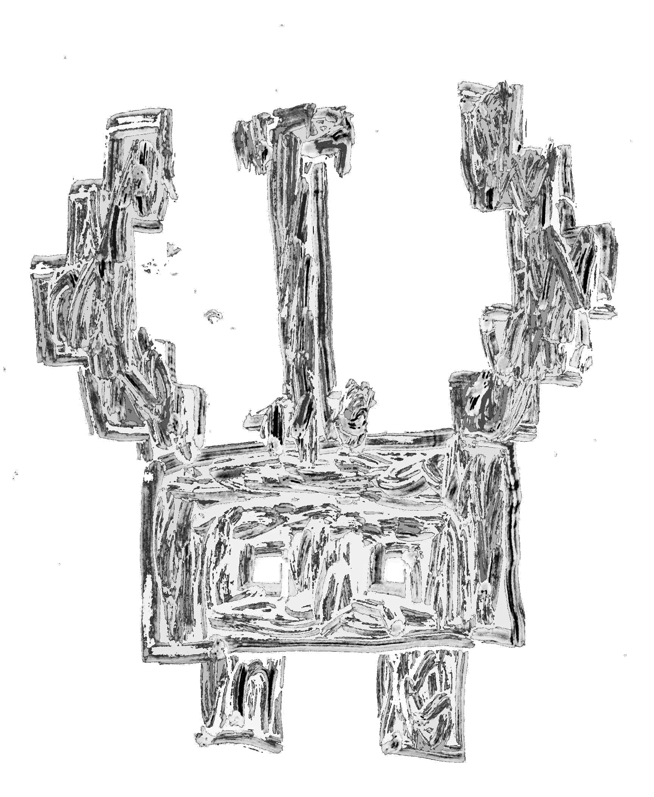

# Characters
## The fallen Ruler

### Description

The creature sits in the middle of the room. Its two eyes seem to have a sad complexion to them. The long growths on top of its head resemble a crown crushing the creature and beating it wown. You can see that its spirit has given up and it is waiting out its torment.

### Dialogue

. . .

. . .

For what are you bothering me?

Why are you here? Have I not suffered enough?

Its all my fault ...

What have I done? ...

(The last two repeat until you bring him the royal sword)

NO! take it away. Didn't you hear? I can't. They are lost because of me.

They were so bright, so full of hope they had so much to live for. No ... No, I can't.

Have they moved on? is that why I can't find them. Oh please no they were all I have had left. I cant take up the mantle again.

I have told you I can't. Find somone more worthy then me, someone to carry on the legacy, someone to carry the crown. Bring it to them if they are still even here... Oh what have I done. Leave me.

(After you give the heir the sword the heir will appear beside the Ruler)

I can't believe it you returned to me. I failed you, I... 

I wasn't strong enough I couldn't stop them. They took you and I couldn't...

(Heir)
I... 

I forgive you. 

(Ruler)
You do? Why? 

(Heir)

Because you showed me the way. 

You couldnt stop them, but neither could I. You at least fought against them when all I did was run and hide. You showed me who to be and what our world needed.
